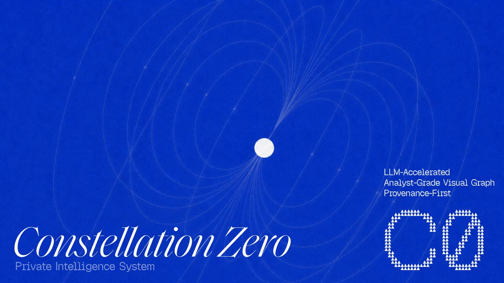

# Constellation Zero

**The private intelligence system for evidence-backed decisions, relationships, and investigations.**

Constellation Zero is an open-source private intelligence system for turning scattered documents, conversations, research, relationships, and decisions into a living intelligence picture you can inspect, challenge, and act on.

It combines an evidence-preserving knowledge layer with an analyst-grade visual graph, temporal relationship analysis, bounded research, decision memory, and LLM-accelerated workflows. The result is a system that helps you understand not only what is connected, but why the connection exists, when it was true, what supports it, what contradicts it, and what changed.

Constellation Zero is **LLM-accelerated, model-agnostic, and harness-agnostic**. The reference deployment uses Hermes Agent and Obsidian, but neither is required. You can connect local models, approved cloud models, custom agents, other orchestration frameworks, your own interface, or no model at all. The canonical record remains human-readable Markdown and preserved source material under your control.

## The problem

Important intelligence is distributed across files, email, meeting notes, decks, business cards, chat, public sources, analyst judgments, and institutional memory.

Most tools handle one part of the problem:

- A document system stores files.
- A CRM stores relationship fields.
- An LLM wiki stores rewritten summaries.
- A vector database retrieves similar text.
- A graph tool draws connections.
- A research tool finds web pages.

The hard work begins when you need to combine those things and defend the result.

You need to know:

- What do we actually know about this person, company, or network?
- Which source supports each claim?
- Was this relationship true at the time under investigation?
- Is this a relationship, or merely two names appearing in the same document?
- Who connects these entities, and how strong is that path?
- What changed since the last review?
- Which conclusions are sourced, inferred, disputed, stale, or unresolved?
- What did we decide, why did we decide it, and what has changed since?

Constellation Zero is built for that layer between raw information and consequential judgment.

## What you can see

The visual graph is the fastest way to understand the system.

Open an entity, a company, a deal, a risk pattern, or a research question and see a visual, filterable network of the records connected to it:

- people, companies, organizations, sources, claims, interactions, decisions, opportunities, and events;
- directed and typed relationships such as ownership, control, employment, funding, advice, competition, supply, and partnership;
- evidence-backed edges with source anchors and confidence context;
- relationships that appear, expire, or change across a selected time range;
- influential nodes, intermediaries, components, and connected clusters;
- filtered paths between two entities at a chosen date;
- graph-linked facets and histograms for narrowing a large network;
- material changes since the previous snapshot;
- review candidates and unresolved relationships clearly separated from promoted knowledge.

The graph is not a static picture exported from an analyst's head. It is a visual projection of the canonical intelligence record. Select an edge and trace it back to the source, excerpt, page, slide, timestamp, or OCR region that supports it. Select a claim and see its confidence, corroboration, contradiction, supersession history, and review state. Move the timeline and see the network change with it.

The picture helps you see the pattern. The evidence lets you defend it.

### Accessing the visual graph

Constellation Zero supports two visual access paths. The standalone path is harness-independent. The richer reference deployment is available through the optional Constellation Hermes dashboard plugin.

For a local browser graph without Hermes, run:

```bash
PYTHONPATH=src python scripts/graph_server.py
```

Then open `http://127.0.0.1:3457`. The standalone server reads the canonical vault, serves a React Flow-compatible graph projection, and provides a read-only browser surface with node and edge details, focus by entity, confidence filtering, controls, and a minimap. It requires no Hermes harness, agent, LLM, or provider credentials.

After the Hermes dashboard plugin is installed and the local dashboard is running, open the **Constellation** tab for the richer deployment surface.

Both surfaces read the same canonical vault. The Hermes graph tab adds typed node and edge rendering, evidence and review-state styling, predicate and confidence filters, as-of temporal filtering, node details, ego focus, all-shortest path mode, SNA and community views, typology and hypothesis panels, and graph-delta investigation.

Promotion and canonical mutation remain in the CLI and review workflow. React Flow workflow editing is a separate extension point; the current graph surface is intentionally read-only so visual exploration cannot silently change trusted intelligence.

## The core distinction

Constellation Zero is built around a simple rule:

> Every node, relationship, score, path, alert, and risk signal must be traceable to canonical records and preserved evidence.

That rule creates several differences at once:

- A source is not a claim.
- A claim is not a fact.
- A mention is not a relationship.
- A relationship is not necessarily current.
- A model proposal is not trusted knowledge.
- A graph projection is not the system of record.
- A summary is not a substitute for the source trail.

Constellation preserves those distinctions instead of compressing them into one page, one embedding, or one opaque score.

## Why it is different from an LLM wiki

LLM-wikis and agent-memory products are useful when the job is to make a body of text easier to query. Constellation Zero addresses the harder problem: maintaining a reviewable intelligence record as evidence, relationships, and judgments change over time.

### 1. An LLM wiki rewrites knowledge into pages

When an agent updates a page, the prior wording, uncertainty, and source context can disappear into the rewrite.

Constellation preserves the source first, stages proposed changes, and keeps the canonical record review-gated. A model can suggest a person, claim, relationship, decision, or next action. It does not silently promote it.

### 2. An LLM wiki gives you a current summary

A current summary can hide what was believed six months ago, what evidence changed, or why a decision was made.

Constellation keeps time-aware claims, decisions, interactions, observations, and supersession chains. You can ask what changed, when it changed, and which evidence drove the change.

### 3. An LLM wiki flattens confidence into prose

A sentence can sound certain even when it came from one weak source or an uncertain extraction.

Constellation carries evidence, confidence, source authority, corroboration, time context, and contradiction state. Confidence can decay without support and strengthen with confirming evidence. The base record remains inspectable; computed confidence does not overwrite history.

### 4. An LLM wiki hides contradictions

Most summaries prefer a coherent answer. Real intelligence work often contains competing claims.

Constellation detects contradictions and stages resolution proposals. The human decides whether one claim supersedes another, whether both remain qualified, or whether the conflict is unresolved.

### 5. An LLM wiki treats retrieval as the product

Finding a similar paragraph is useful. It does not establish identity, ownership, control, influence, chronology, or causality.

Constellation combines lexical, semantic, temporal, and graph retrieval while retaining the evidence trail and the limits of each result.

### 6. An LLM wiki is usually optimized for prose

Prose is a poor interface for understanding a network of entities and relationships.

Constellation gives analysts a visual graph, directed paths, timeline scrubbing, centrality measures, cluster views, facets, and dossiers — all linked to the underlying records and sources.

### 7. An LLM wiki makes the model the center of gravity

Your memory becomes dependent on one model, one vendor, one prompt layer, or one chat interface.

Constellation is model- and harness-agnostic. Hermes and Obsidian are the default operating surfaces, not the boundary of the product. Replace the model, agent, interface, or deployment without abandoning the canonical intelligence record.

## Why it is different from traditional graph and link-analysis tools

Traditional analyst tools established the value of visual network analysis. Constellation Zero carries that value into a more portable, evidence-native architecture.

It gives you:

- a visual network view without making the visual graph the only source of truth;
- temporal edges instead of timeless lines that flatten history;
- typed relationships instead of generic links;
- source-backed assertions instead of unsupported connections;
- reviewable candidates instead of automatic graph pollution;
- explainable scores instead of opaque model-generated influence;
- rebuildable projections instead of proprietary graph state;
- human-readable records instead of a closed analyst file format;
- local-first operation without requiring Neo4j, Elasticsearch, Kafka, or an always-on graph service;
- export manifests and clearance boundaries for controlled sharing.

The graph is where the analyst sees the intelligence. The evidence layer is why the analyst can trust, challenge, and reuse it.

## Who uses Constellation Zero

### Corporate intelligence and investigations teams

Map ownership, control, employment, funding, partnerships, suppliers, and influence. Identify intermediaries, trace time-valid paths, compare snapshots, and produce a sourced dossier for a decision-maker.

### OSINT researchers and investigative journalists

Build a defensible network from public sources. Preserve the original material, separate mentions from relationships, track source quality, and show which edges are confirmed, proposed, or unresolved.

### Government affairs and public-policy teams

Maintain a long-memory record of ministries, officials, advisors, counterparties, commitments, and political or regulatory developments. Prepare formal briefs without relying on one person's inbox or memory.

### Defense, security, and risk teams

Investigate networks, monitor material changes, apply evidence-backed risk typologies, and export bounded intelligence packets without silently promoting model findings into facts.

### Financial crime, compliance, and due-diligence teams

Review beneficial ownership, control, related parties, intermediaries, and changing corporate structures. Preserve the source trail and the reasoning behind escalations.

### Investors and deal teams

Connect company claims, filings, leadership, financing, customers, competitors, and risks into a time-aware diligence record. Return to the evidence when the investment committee asks what supports the conclusion.

### Founders, executives, and principals

Prepare for negotiations, board meetings, acquisitions, partnerships, and sensitive counterparties. See the relationship history, open commitments, unresolved claims, recent changes, and relevant paths before acting.

### Advisors, consultants, and professional-services firms

Carry context across clients and engagements. Turn interviews, decks, research, and decisions into reusable intelligence instead of isolated deliverables that disappear when the project closes.

### Business development and partnership teams

Understand the network behind a target account or partner. See who connects the organization, which relationship is stale, what was promised, and which evidence supports the next move.

### Research programs and policy institutes

Maintain claims that evolve over months or years. Track corroboration, contradiction, supersession, and source quality while preserving the intellectual history of the program.

### Family offices and private investment offices

Keep sensitive relationship, counterparty, diligence, and decision intelligence under controlled data and model boundaries rather than in a public SaaS knowledge base.

### Engineering teams building private AI

Use Constellation as the canonical evidence and operating layer beneath agents, models, connectors, and interfaces. Give automation a clear boundary: it can propose and explain; humans approve what becomes trusted memory.

### Integrators and intelligence-platform builders

Use the open-source record model, validation rules, graph projection, review contract, and connector capability model as a foundation for a private deployment or sector-specific intelligence product.

## Representative scenarios

### From a conference contact to a relationship brief

Capture a card, encounter note, and deck. Preserve the original files. Extract candidate details locally. Review the proposed identity and company links. Run a bounded inquiry if needed. Before the next conversation, generate a cited brief containing the history, shared context, open questions, and next action.

### From a company filing to a changing ownership graph

Ingest official filings and related source material. Create sourced ownership and control candidates. Promote reviewed relationships. View the graph, filter by relationship type, scrub the timeline, and receive a bounded alert when a material edge changes.

### From scattered research to an intelligence dossier

Gather approved sources under a declared research budget and egress policy. Preserve selected pages and receipts. Separate source statements, corroborated claims, analyst judgments, and unresolved contradictions. Generate a clearance-bounded dossier with an export manifest.

### From a meeting to a durable decision trail

Capture the meeting and attachments. Record the decision, rationale, alternatives, assumptions, owner, and review date. Later, connect new evidence to the decision and show whether the original assumptions held.

### From co-mentions to a defensible relationship

A document mentions two people. Constellation records a mention hit and investigative lead. It does not create a relationship automatically. A relationship candidate requires explicit endpoints, predicate, source IDs, and supporting evidence before review.

### From an emerging risk pattern to a reviewable finding

Run a configured graph typology against the validated record. The system produces a sourced finding candidate with the pattern, supporting edges, confidence context, and relevant evidence. An analyst reviews it before it enters the trusted record or an external report.

## Feature set

### Visual graph and analyst workbench

- Interactive entity graph with typed, directed, sourced relationships
- Time-aware graph views and timeline scrubbing
- Filtered directed paths valid at a selected date
- Degree, betweenness, PageRank, components, intermediaries, and influence views
- Histogram and facet filtering with graph-linked selection
- Cluster and subgraph exploration
- Deterministic edge IDs for selection persistence, deltas, and exports
- Graph change detection against preserved snapshots
- Evidence-backed risk typologies
- 360-degree dossiers with clearance-bounded export manifests
- Review-state visibility for proposed, promoted, stale, superseded, and contradicted records

### Evidence and canonical records

- Source preservation with hashes, media types, capture metadata, and stable anchors
- Extracted text, tables, slide notes, cells, OCR regions, and transcript evidence
- Typed records for entities, sources, claims, relationships, interactions, decisions, inquiries, opportunities, observations, events, and analyses
- Human-readable Markdown as canonical storage
- Rebuildable search indexes, projections, caches, dashboards, and graph views
- Versioned, conflict-checked changes
- Source, claim, inference, and decision separation

### Relationship intelligence

- Directed and typed relationships
- Real-world validity intervals and observation intervals
- Roles, qualifiers, and relationship-specific metadata
- Controlled predicate registry with inverse, domain, range, stability, and alias rules
- FollowTheMoney-compatible local import and export
- Mention hits and co-mention candidates kept separate from canonical relationships
- Review-gated identity matching and merge proposals

### Research and discovery

- Bounded inquiries with scope, sensitivity, source preference, budget, and stop condition
- Broad keyword, semantic, independent, and time-sensitive discovery lanes
- Controlled extraction ladder for difficult web pages
- Official-source connectors and local source capture
- Egress policy for every external call
- Receipts for searches, fetches, failures, partial results, and provider decisions
- Evidence packets linking source material, claims, contradictions, open questions, and next actions

### Knowledge lifecycle

- Typed supersession chains between claims and relationships
- Living confidence that decays and strengthens under explicit rules
- Contradiction detection and review-only resolution proposals
- Crystallization of completed work sessions into cited digests
- Self-healing lint for safe mechanical repairs
- Journaled, byte-exact rollback
- Multi-writer merge semantics with expected-hash writes and conflict surfacing
- Ingest-time secret and PII screening with block, warn, quarantine, and off profiles

### Monitoring and operating intelligence

- Watchlists, preserved snapshots, and deterministic diffs
- Material-change candidates and bounded alerts
- Decision trails with assumptions, alternatives, owners, and review dates
- Meeting briefs and relationship histories
- Opportunity and pipeline context tied to evidence
- Stale relationship and overdue commitment detection
- Full-text, semantic, hybrid, and graph retrieval
- Strategic analyses and cited briefings

### Model, harness, and deployment independence

- Provider-neutral model adapters
- Local, cloud, or mixed model deployments
- Explicit egress and sensitivity controls
- Hermes Agent reference integration
- Obsidian reference workspace
- CLI and plugin/tool surfaces
- Custom interfaces and agent frameworks supported through the canonical record and review contract
- No silent model writes to trusted knowledge

## The operating contract

Constellation Zero keeps the following rules inside the product:

- Sources are preserved before interpretation.
- Every claim retains evidence, confidence, and time context.
- Mentions do not become relationships without evidence and review.
- Contradictory and superseded information remains visible.
- Machine-generated candidates remain candidates until approved.
- External research and model calls pass through explicit policy.
- Failed, incomplete, stale, and degraded results remain visible.
- The canonical record is portable and human-readable.
- Graphs and indexes are derived from the record and can be rebuilt.

## What Constellation Zero is not

- **Not a generic chatbot.** Chat is one possible interface. The intelligence record lives outside the conversation.
- **Not an LLM wiki.** Summaries do not replace evidence, history, or review.
- **Not a conventional CRM.** Relationship fields do not explain the network, evidence, or decision logic behind them.
- **Not a vector database.** Embeddings assist retrieval; they do not become the system of record.
- **Not a black-box graph.** Every meaningful node, edge, score, path, and alert is explainable and source-linked.
- **Not an autonomous outreach robot.** It can prepare actions and alerts; it does not silently contact people or alter trusted facts.
- **Not locked to one model, agent, or interface.** Hermes and Obsidian are the reference deployment, not a dependency of the record.

## The open-source core and the deployment around it

Constellation Zero provides the canonical record model, validation, source preservation, intake, review workflow, knowledge lifecycle, graph intelligence, projections, retrieval, CLI, and a standalone local React Flow graph server. The optional Hermes dashboard plugin provides the richer local graph and read-model analytics surface.

A complete deployment may add models, agent orchestration, connectors, scheduled monitoring, notification channels, identity and access controls, local web interfaces, and organization-specific workflows. Hermes is the reference harness, but the standalone graph server and canonical APIs allow other interfaces and harnesses to consume the same projections and records.

The deployment can change without migrating the intelligence. The record stays yours.

## Agent skills: the operating layer

Constellation Zero also includes reusable agent skills that teach an agent how to work with the system safely and consistently.

The bundled Constellation skill is a portable, provider-independent operating contract. It covers:

- how to preserve original source bytes and provenance;
- how to separate mechanical extraction, source claims, prior evidence, and inference;
- how to avoid inventing entity matches or turning mentions into relationships;
- how to follow intake, first-distillation, search, research, review, and repair modes;
- how to respect sensitivity labels and model-egress policy;
- how to stage candidates instead of writing unreviewed facts;
- how to validate canonical writes, rebuild indexes, and produce completion receipts;
- how to stop when a task requires a separate research or approval decision.

These skills sit above the model and below the user's workflow. An agent can load them, adapt them to a deployment, extend them with domain-specific procedures, and improve them as the operating model matures. A new model does not need the build history of Constellation; it needs the current skill, evidence contract, schemas, and bounded task context.

This is an important part of the system's portability. The skill carries the method. The model supplies interpretation. The canonical record, validation layer, and review gate enforce the boundary.

### Companion skill packs

The Constellation operating skill is the base layer. A deployment can add domain-specific skills that use the same evidence, provenance, and review contracts.

Examples include:

- **LinkedIn OSINT** — capture a single profile into a source-separated person dossier, with identity restraint and a handoff to deeper research;
- **OSINT research** — run bounded or deep multi-source investigations while preserving search receipts, source quality, contradictions, and open questions;
- **Company and filing intelligence** — use SEC/EDGAR and other official-source workflows to build evidence-backed company and ownership context;
- **Transaction diligence** — investigate M&A, valuation, funding, ownership, and unresolved counterparty signals;
- **Corporate and regional intelligence** — adapt research workflows to APAC firms, local markets, professional-services networks, and cross-border operating reality;
- **Document and media intake** — process decks, PDFs, spreadsheets, images, business cards, meeting notes, and audio into reviewable evidence;
- **Constellation vault operations** — validate canonical records, stage claims, manage inquiries, refine research, and maintain the private intelligence substrate.

These packs are not separate memory stores. They are reusable methods for agents working against the same canonical record. They can be loaded selectively, adapted to a sector, combined into a deployment workflow, or replaced without changing the underlying evidence model.

### What is included, and what is not

Constellation Zero includes the record system, graph intelligence, CLI, review contract, and reusable Constellation operating skill. Companion skill packs can be installed or developed around it.

It does **not** bundle:

- a large language model;
- model-provider credentials;
- a generic autonomous agent;
- a mandatory agent harness;
- an always-on worker that can modify the vault without review.

Hermes Agent is the reference harness because it provides a natural way to load skills, invoke bounded tools, switch providers, and operate the system through conversational workflows. Other harnesses can use the same skills and contracts if they respect the canonical record and review boundary. Obsidian is the reference human workspace, not a runtime requirement.

## Privacy and control

Canonical records and preserved source files can remain local. External model and research calls are optional and policy-controlled. The egress policy determines what may leave the machine, which provider may receive it, for what purpose, and at what sensitivity.

Constellation does not claim that every deployment is automatically local-only. It provides the boundary so a deployment can make that decision explicitly and auditably.

## Try it

```bash
git clone https://github.com/skyeyesec333/hermes-constellation.git
cd hermes-constellation
```

Start with the synthetic demo vault and the installation guide. The core can run without a cloud key.

## Status

Constellation Zero v2 is the completed beta release of the private intelligence core, including the i2-successor graph intelligence build, visual graph analysis, temporal relationship analysis, bounded research, review-gated knowledge lifecycle, monitoring, and deployment-neutral model architecture.

The public repository is an open-source reference implementation and foundation for private deployments, integrations, and sector-specific intelligence systems.

## License

Apache-2.0.
